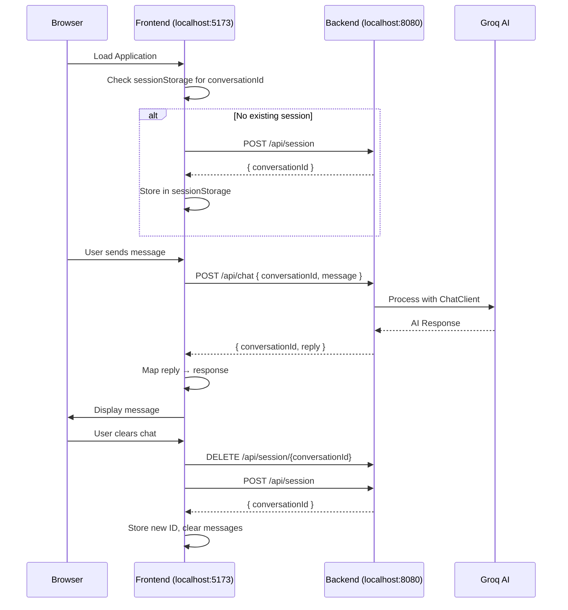

# Design Document: Frontend-Backend Integration

## Overview

This design document outlines the integration approach for connecting the FastChat React frontend with the Spring Boot backend for local development. The integration involves four main areas: API URL configuration, CORS setup, API contract alignment, and session management.

## Architecture



## Components and Interfaces

### 1. Frontend API Client (`api.ts`)

The API client module will be updated to:
- Use environment-based URL configuration
- Include session management
- Handle request/response mapping

```typescript
// Configuration
const API_URL = import.meta.env.VITE_API_URL || 'http://localhost:8080';

// Session management
let conversationId: string | null = null;

async function getOrCreateSession(): Promise<string> {
  // Check sessionStorage first
  const stored = sessionStorage.getItem('fastchat_conversation_id');
  if (stored) {
    conversationId = stored;
    return stored;
  }
  
  // Create new session
  const response = await fetch(`${API_URL}/api/session`, { method: 'POST' });
  const data = await response.json();
  conversationId = data.conversationId;
  sessionStorage.setItem('fastchat_conversation_id', conversationId);
  return conversationId;
}

async function sendMessage(message: string): Promise<ChatResponse> {
  const sessionId = await getOrCreateSession();
  
  const response = await fetch(`${API_URL}/api/chat`, {
    method: 'POST',
    headers: { 'Content-Type': 'application/json' },
    body: JSON.stringify({ conversationId: sessionId, message }),
  });
  
  const data = await response.json();
  
  // Map backend response to frontend format
  return {
    response: data.reply,
    model: data.model || 'llama-3.3-70b-versatile',
    tokenUsed: data.tokenUsed || 0,
  };
}

async function clearSession(): Promise<void> {
  if (conversationId) {
    await fetch(`${API_URL}/api/session/${conversationId}`, { method: 'DELETE' });
  }
  sessionStorage.removeItem('fastchat_conversation_id');
  conversationId = null;
}
```

### 2. Backend CORS Configuration (`CorsConfig.java`)

A new configuration class to enable CORS for local development:

```java
@Configuration
public class CorsConfig implements WebMvcConfigurer {
    
    @Value("${cors.allowed-origins:http://localhost:5173}")
    private String allowedOrigins;
    
    @Override
    public void addCorsMappings(CorsRegistry registry) {
        registry.addMapping("/api/**")
            .allowedOrigins(allowedOrigins.split(","))
            .allowedMethods("GET", "POST", "DELETE", "OPTIONS")
            .allowedHeaders("Content-Type")
            .allowCredentials(true);
    }
}
```

### 3. Frontend Vite Configuration (`vite.config.ts`)

Update to use port 5173 (Vite default) to avoid conflict with backend:

```typescript
export default defineConfig({
  server: {
    host: "::",
    port: 5173,  // Changed from 8080
  },
  // ... rest of config
});
```

## Data Models

### Frontend Types (`chat.ts`)

No changes needed to the existing types. The API client will handle the mapping.

### Backend DTOs

Existing DTOs remain unchanged:
- `ChatRequest(conversationId, message)`
- `ChatResponse(conversationId, reply)`
- `SessionResponse(conversationId)`

### Request/Response Mapping

| Frontend Field | Backend Field | Direction |
|---------------|---------------|-----------|
| `message` | `message` | Request |
| (generated) | `conversationId` | Request |
| `response` | `reply` | Response |
| `model` | (not provided) | Response (default) |
| `tokenUsed` | (not provided) | Response (default) |

## Correctness Properties

*A property is a characteristic or behavior that should hold true across all valid executions of a system—essentially, a formal statement about what the system should do. Properties serve as the bridge between human-readable specifications and machine-verifiable correctness guarantees.*

### Property 1: Environment Variable Override

*For any* value set in the `VITE_API_URL` environment variable, the API_Client SHALL use that exact value as the base URL for all API requests.

**Validates: Requirements 1.2**

### Property 2: Request Body Structure

*For any* message sent through the API_Client, the request body SHALL contain both a non-empty `conversationId` string and the `message` string.

**Validates: Requirements 3.1**

### Property 3: Session ID Uniqueness

*For any* sequence of session creations (including after chat clears), all generated conversation IDs SHALL be unique.

**Validates: Requirements 3.2, 3.4**

### Property 4: Response Field Mapping

*For any* backend response containing a `reply` field, the mapped frontend response SHALL have a `response` field with the identical value.

**Validates: Requirements 4.1**

### Property 5: Graceful Degradation

*For any* backend response missing `model` or `tokenUsed` fields, the frontend SHALL successfully process the response and provide default values without throwing errors.

**Validates: Requirements 4.2, 4.3**

## Error Handling

### Frontend Error Scenarios

| Scenario | Handling |
|----------|----------|
| Backend unreachable | Display "Server error. Please try again later." |
| Session creation fails | Retry once, then show error |
| Invalid response format | Log error, display generic error message |
| CORS blocked | Display connection error (dev should check CORS config) |

### Backend Error Scenarios

| Scenario | HTTP Status | Response |
|----------|-------------|----------|
| Missing conversationId | 400 | Validation error message |
| Missing message | 400 | Validation error message |
| Message too long | 400 | Validation error message |
| AI service error | 500 | Internal server error |

## Testing Strategy

### Unit Tests

1. **API Client Tests**
   - Test URL configuration with different environment values
   - Test request body structure
   - Test response mapping logic
   - Test session storage interactions

2. **CORS Configuration Tests**
   - Test allowed origins configuration
   - Test allowed methods
   - Test allowed headers

### Property-Based Tests

Property-based testing will use **fast-check** for TypeScript tests to validate:

1. **Response Mapping Property** - For any valid backend response, mapping produces valid frontend response
2. **Session ID Uniqueness Property** - Generated IDs are always unique across multiple generations
3. **Request Structure Property** - All requests contain required fields

Configuration:
- Minimum 100 iterations per property test
- Tag format: **Feature: frontend-backend-integration, Property {number}: {property_text}**

### Integration Tests

1. **End-to-End Flow**
   - Start backend on port 8080
   - Start frontend on port 5173
   - Verify session creation
   - Verify message send/receive
   - Verify chat clear functionality
